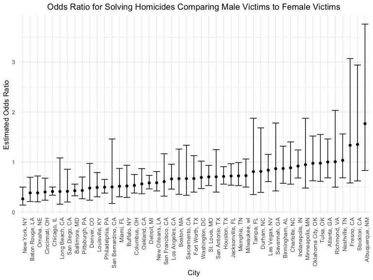

P8105 Homework 6
================
Hyun Kim (hk3373)
2024-12-02

# Problem 1

## Download 2017 Central Park weather data

``` r
weather_df = 
  rnoaa::meteo_pull_monitors(
    c("USW00094728"),
    var = c("PRCP", "TMIN", "TMAX"), 
    date_min = "2017-01-01",
    date_max = "2017-12-31") %>%
  mutate(
    name = recode(id, USW00094728 = "CentralPark_NY"),
    tmin = tmin / 10,
    tmax = tmax / 10) %>%
  select(name, id, everything())
```

    ## using cached file: /Users/hyee/Library/Caches/org.R-project.R/R/rnoaa/noaa_ghcnd/USW00094728.dly

    ## date created (size, mb): 2024-11-17 16:08:26.11199 (8.667)

    ## file min/max dates: 1869-01-01 / 2024-11-30

## Use 5000 bootstrap samples and produce estimates for each boostrap sample

``` r
boot_strap_df =
  weather_df |>
  bootstrap(n = 5000) |>
  mutate(models = map(strap, \(df) lm(tmax ~ tmin, data = df)))

r_squared_df =
  boot_strap_df |>
  mutate(r_squared = map(models, broom::glance)) |> 
  select(-strap, -models) |> 
  unnest(r_squared)

log_beta_df = 
  boot_strap_df |>
  mutate(beta = map(models, broom::tidy)) |> 
  select(-strap, -models) |> 
  unnest(beta) |>
  select(.id, term, estimate) |>
  pivot_wider(
    names_from = term,
    values_from = estimate
  ) |>
  rename(intercept = "(Intercept)") |>
  mutate(log_beta = log(intercept * tmin))
```

## Plot distribution of the estimates

### Estimate of r^2

``` r
r_squared_df |>
  ggplot(aes(x = r.squared)) +
  geom_density() + 
  labs(y = "count",
       x = "Estimate of r^2",
       title = "Distribution of the Estimate of r^2")
```

<!-- -->

The plot shows that the distribution of the estimate of r^2 is normal.

### Estimate of log(B0 \* B1)

``` r
log_beta_df |>
  ggplot(aes(x = log_beta)) + 
  geom_density() + 
  labs(y = "count",
       x = "Estimate of log(B0 * B1)",
       title = "Distribution of the Estimate of log(B0 * B1)")
```

<!-- -->

The plot shows that the distribution of the estimate of log(B0 \* B1) is
normal.

## Compute 95% confidence interval for the estimates

### CI of r^2 Estimate

``` r
r_squared_df |>
  summarize(
    r2_CI_lower = quantile(r.squared, 0.025),
    r2_CI_upper = quantile(r.squared, 0.975)
  ) |>
  knitr::kable(digits = 3)
```

| r2_CI_lower | r2_CI_upper |
|------------:|------------:|
|       0.894 |       0.927 |

### CI of log(B0 \* B1) Estimate

``` r
log_beta_df |>
  summarize(
    log_CI_lower = quantile(log_beta, 0.025),
    log_CI_upper = quantile(log_beta, 0.975)
  ) |>
  knitr::kable(digits = 3)
```

| log_CI_lower | log_CI_upper |
|-------------:|-------------:|
|        1.965 |         2.06 |

# Problem 2

## Import and tidy Homicide dataset

``` r
homicide_df = 
  read_csv(file = "data/homicide-data.csv",
           na = c("", "Unknown")) |>
  janitor::clean_names() |>
  mutate(city_state = str_c(city, state, sep = ", "),
         resolved = as.numeric(disposition == "Closed by arrest"),
         victim_age = as.numeric(victim_age), 
         victim_race = as.factor(victim_race)) |>
  filter(!(city_state %in% c("Dallas, TX", "Phoenix, AZ", 
                             "Kansas City, MO", "Tulsa, AL")),
         victim_race %in% c("White", "Black"))
```

    ## Rows: 52179 Columns: 12
    ## ── Column specification ────────────────────────────────────────────────────────
    ## Delimiter: ","
    ## chr (8): uid, victim_last, victim_first, victim_race, victim_sex, city, stat...
    ## dbl (4): reported_date, victim_age, lat, lon
    ## 
    ## ℹ Use `spec()` to retrieve the full column specification for this data.
    ## ℹ Specify the column types or set `show_col_types = FALSE` to quiet this message.

## Use glm to fit logistic regression with resolved vs unresolved as the outcome and victim age, sex and race as predictors for Baltimore, MD

``` r
baltimore_glm =
  homicide_df |> 
  filter(city_state == "Baltimore, MD") |>
  glm(resolved ~ victim_age + victim_sex + victim_race, 
      data = _, family = binomial())
```

## Obtain the estimate and CI of the adjusted odds ratio for solving homicides comparing male victims to female victims in Baltimore, MD

``` r
baltimore_glm |>
  broom::tidy() |>
  mutate(OR = exp(estimate),
         CI_lower = exp(estimate - 1.96 * std.error),
         CI_upper = exp(estimate + 1.96 * std.error)) |>
  filter(term == "victim_sexMale") |>
  select(OR, CI_lower, CI_upper) |>
  knitr::kable(digits = 3)
```

|    OR | CI_lower | CI_upper |
|------:|---------:|---------:|
| 0.426 |    0.325 |    0.558 |

## Run glm and extract adjusted odds ratio & CI for each of the cities in the dataset

``` r
city_glm_df = 
  homicide_df |>
  nest(data = -city_state) |>
  mutate(models = map(data, \(df) glm(resolved ~ victim_age + victim_sex 
                                      + victim_race, data = df, 
                                      family = binomial())),
         results = map(models, broom::tidy))|>
  select(-data, -models) |>
  unnest(results) |>
  mutate(OR = exp(estimate),
         CI_lower = exp(estimate - 1.96 * std.error),
         CI_upper = exp(estimate + 1.96 * std.error)) |>
  filter(term == "victim_sexMale") |>
  select(city_state, OR, CI_lower, CI_upper) 
```

## Plot that shows the estimated ORs and CIs for each city

``` r
city_glm_df |>
  ggplot(aes(y = OR, x = reorder(city_state, OR))) + 
  geom_point() +
  geom_errorbar(aes(ymin = CI_lower, ymax = CI_upper)) + 
  theme(axis.text.x = element_text(angle = 90, hjust = 1)) +
  labs(y = "Estimated Odds Ratio",
       x = "City", 
       title = "Odds Ratio for Solving Homicides Comparing Male Victims to Female Victims")
```

<!-- -->

Based on the plot, most cities have an odds ratio that is below the
value of 1, which suggests that the odds of solving homicides with male
victims are lower than female victims for those cities, after adjusting
for the other variables (age and sex).

Many cities with an odds ratio lower than 1 have a confidence interval
that does not include the value of 1, which suggests that gender has a
statistical significance in solving homicides for those cities, after
adjusting for age and sex.

There are some cities, such as Atlanta and Richmond, that have an odds
ratio approximately equal to 1, which suggests that gender has no
association in solving homicides for those cities.
