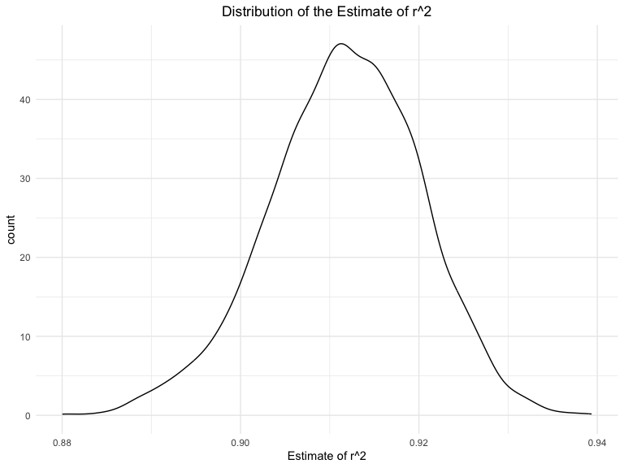
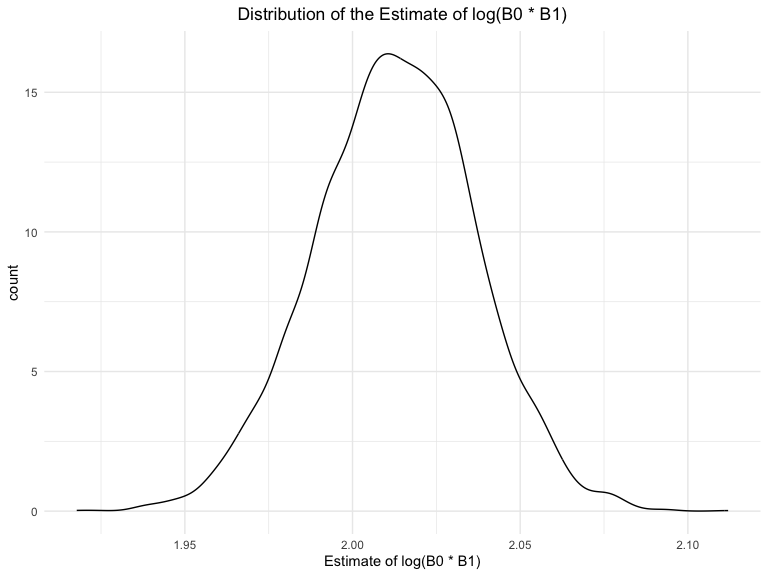

P8105 Homework 6
================
Hyun Kim (hk3373)
2024-12-02

# Problem 1

## Download 2017 Central Park weather data

``` r
weather_df = 
  rnoaa::meteo_pull_monitors(
    c("USW00094728"),
    var = c("PRCP", "TMIN", "TMAX"), 
    date_min = "2017-01-01",
    date_max = "2017-12-31") %>%
  mutate(
    name = recode(id, USW00094728 = "CentralPark_NY"),
    tmin = tmin / 10,
    tmax = tmax / 10) %>%
  select(name, id, everything())
```

    ## using cached file: /Users/hyee/Library/Caches/org.R-project.R/R/rnoaa/noaa_ghcnd/USW00094728.dly

    ## date created (size, mb): 2024-11-17 16:08:26.11199 (8.667)

    ## file min/max dates: 1869-01-01 / 2024-11-30

## Use 5000 bootstrap samples and produce estimates for each boostrap sample

``` r
boot_strap_df =
  weather_df |>
  bootstrap(n = 5000) |>
  mutate(models = map(strap, \(df) lm(tmax ~ tmin, data = df)))

r_squared_df =
  boot_strap_df |>
  mutate(r_squared = map(models, broom::glance)) |> 
  select(-strap, -models) |> 
  unnest(r_squared)

log_beta_df = 
  boot_strap_df |>
  mutate(beta = map(models, broom::tidy)) |> 
  select(-strap, -models) |> 
  unnest(beta) |>
  select(.id, term, estimate) |>
  pivot_wider(
    names_from = term,
    values_from = estimate
  ) |>
  rename(intercept = "(Intercept)") |>
  mutate(log_beta = log(intercept * tmin))
```

## Plot distribution of the estimates

### Estimate of r^2

``` r
r_squared_df |>
  ggplot(aes(x = r.squared)) +
  geom_density() + 
  labs(y = "count",
       x = "Estimate of r^2",
       title = "Distribution of the Estimate of r^2")
```

<!-- -->

The plot shows that the distribution of the estimate of r^2 is normal.

### Estimate of log(B0 \* B1)

``` r
log_beta_df |>
  ggplot(aes(x = log_beta)) + 
  geom_density() + 
  labs(y = "count",
       x = "Estimate of log(B0 * B1)",
       title = "Distribution of the Estimate of log(B0 * B1)")
```

<!-- -->

The plot shows that the distribution of the estimate of log(B0 \* B1) is
normal.

## Compute 95% confidence interval for the estimates

### CI of r^2 Estimate

``` r
r_squared_df |>
  summarize(
    r2_CI_lower = quantile(r.squared, 0.025),
    r2_CI_upper = quantile(r.squared, 0.975)
  ) |>
  knitr::kable(digits = 3)
```

| r2_CI_lower | r2_CI_upper |
|------------:|------------:|
|       0.894 |       0.927 |

### CI of log(B0 \* B1) Estimate

``` r
log_beta_df |>
  summarize(
    log_CI_lower = quantile(log_beta, 0.025),
    log_CI_upper = quantile(log_beta, 0.975)
  ) |>
  knitr::kable(digits = 3)
```

| log_CI_lower | log_CI_upper |
|-------------:|-------------:|
|        1.963 |        2.058 |
